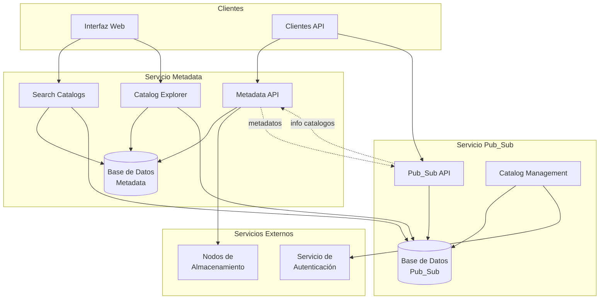
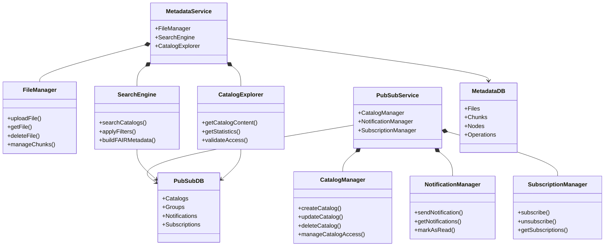
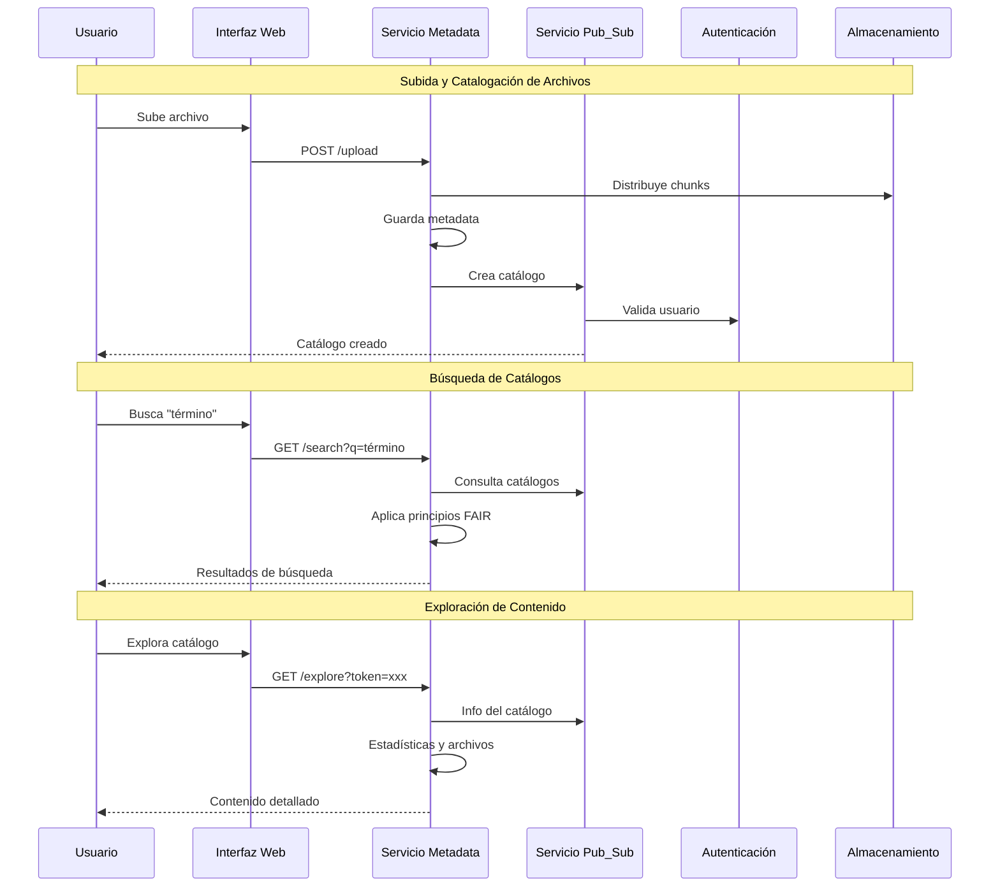
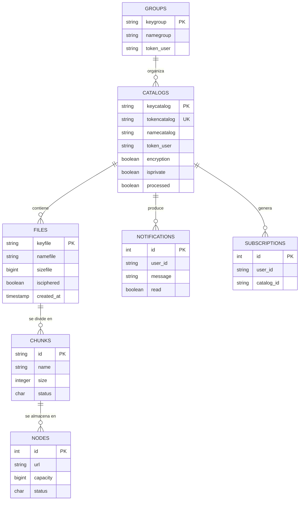

# Documentación UML

## 1. Vista General del Sistema - Diagrama de Componentes

```mermaid
graph TB
    subgraph "Servicio Metadata"
        MetadataAPI[Metadata API]
        SearchAPI[Search Catalogs]
        ExplorerAPI[Catalog Explorer]
        MetaDB[(Base de Datos<br/>Metadata)]
    end
    
    subgraph "Servicio Pub_Sub"
        PubSubAPI[Pub_Sub API]
        CatalogAPI[Catalog Management]
        PubSubDB[(Base de Datos<br/>Pub_Sub)]
    end
    
    subgraph "Servicios Externos"
        AuthService[Servicio de<br/>Autenticación]
        StorageNodes[Nodos de<br/>Almacenamiento]
    end
    
    subgraph "Clientes"
        WebUI[Interfaz Web]
        APIClients[Clientes API]
    end
    
    %% Conexiones principales
    MetadataAPI --> MetaDB
    SearchAPI --> MetaDB
    SearchAPI --> PubSubDB
    ExplorerAPI --> MetaDB
    ExplorerAPI --> PubSubDB
    
    PubSubAPI --> PubSubDB
    CatalogAPI --> PubSubDB
    CatalogAPI --> AuthService
    
    MetadataAPI --> StorageNodes
    
    %% Interacciones con clientes
    WebUI --> SearchAPI
    WebUI --> ExplorerAPI
    APIClients --> MetadataAPI
    APIClients --> PubSubAPI
    
    %% Flujo de datos
    MetadataAPI -.->|metadatos| PubSubAPI
    PubSubAPI -.->|info catalogos| MetadataAPI
```

## 2. Diagrama de Clases Simplificado

```mermaid
classDiagram
    %% Servicio Metadata
    class MetadataService {
        +FileManager
        +SearchEngine
        +CatalogExplorer
    }
    
    class FileManager {
        +uploadFile()
        +getFile()
        +deleteFile()
        +manageChunks()
    }
    
    class SearchEngine {
        +searchCatalogs()
        +applyFilters()
        +buildFAIRMetadata()
    }
    
    class CatalogExplorer {
        +getCatalogContent()
        +getStatistics()
        +validateAccess()
    }
    
    %% Servicio Pub_Sub
    class PubSubService {
        +CatalogManager
        +NotificationManager
        +SubscriptionManager
    }
    
    class CatalogManager {
        +createCatalog()
        +updateCatalog()
        +deleteCatalog()
        +manageCatalogAccess()
    }
    
    class NotificationManager {
        +sendNotification()
        +getNotifications()
        +markAsRead()
    }
    
    class SubscriptionManager {
        +subscribe()
        +unsubscribe()
        +getSubscriptions()
    }
    
    %% Bases de datos
    class MetadataDB {
        +Files
        +Chunks
        +Nodes
        +Operations
    }
    
    class PubSubDB {
        +Catalogs
        +Groups
        +Notifications
        +Subscriptions
    }
    
    %% Relaciones
    MetadataService --> MetadataDB
    PubSubService --> PubSubDB
    SearchEngine --> PubSubDB
    CatalogExplorer --> PubSubDB
    
    MetadataService *-- FileManager
    MetadataService *-- SearchEngine
    MetadataService *-- CatalogExplorer
    
    PubSubService *-- CatalogManager
    PubSubService *-- NotificationManager
    PubSubService *-- SubscriptionManager
```

## 3. Flujo Principal del Sistema

```mermaid
sequenceDiagram
    participant Usuario
    participant Web as Interfaz Web
    participant Meta as Servicio Metadata
    participant PubSub as Servicio Pub_Sub
    participant Auth as Autenticación
    participant Storage as Almacenamiento

    %% Flujo de subida de archivos
    Note over Usuario, Storage: Subida y Catalogación de Archivos
    
    Usuario->>Web: Sube archivo
    Web->>Meta: POST /upload
    Meta->>Storage: Distribuye chunks
    Meta->>Meta: Guarda metadata
    Meta->>PubSub: Crea catálogo
    PubSub->>Auth: Valida usuario
    PubSub-->>Usuario: Catálogo creado
    
    %% Flujo de búsqueda
    Note over Usuario, Storage: Búsqueda de Catálogos
    
    Usuario->>Web: Busca "término"
    Web->>Meta: GET /search?q=término
    Meta->>PubSub: Consulta catálogos
    Meta->>Meta: Aplica principios FAIR
    Meta-->>Usuario: Resultados de búsqueda
    
    %% Flujo de exploración
    Note over Usuario, Storage: Exploración de Contenido
    
    Usuario->>Web: Explora catálogo
    Web->>Meta: GET /explore?token=xxx
    Meta->>PubSub: Info del catálogo
    Meta->>Meta: Estadísticas y archivos
    Meta-->>Usuario: Contenido detallado
```

## 4. Base de Datos Simplificada

```mermaid
erDiagram
    %% Base de Datos Metadata
    FILES {
        string keyfile PK
        string namefile
        bigint sizefile
        boolean isciphered
        timestamp created_at
    }
    
    CHUNKS {
        string id PK
        string name
        integer size
        char status
    }
    
    NODES {
        int id PK
        string url
        bigint capacity
        char status
    }

    %% Base de Datos Pub_Sub
    CATALOGS {
        string keycatalog PK
        string tokencatalog UK
        string namecatalog
        string token_user
        boolean encryption
        boolean isprivate
        boolean processed
    }
    
    GROUPS {
        string keygroup PK
        string namegroup
        string token_user
    }
    
    NOTIFICATIONS {
        int id PK
        string user_id
        string message
        boolean read
    }
    
    SUBSCRIPTIONS {
        int id PK
        string user_id
        string catalog_id
    }

    %% Relaciones principales
    FILES ||--o{ CHUNKS : "se divide en"
    CHUNKS ||--o{ NODES : "se almacena en"
    CATALOGS ||--o{ FILES : "contiene"
    GROUPS ||--o{ CATALOGS : "organiza"
    CATALOGS ||--o{ SUBSCRIPTIONS : "genera"
    CATALOGS ||--o{ NOTIFICATIONS : "produce"
```

